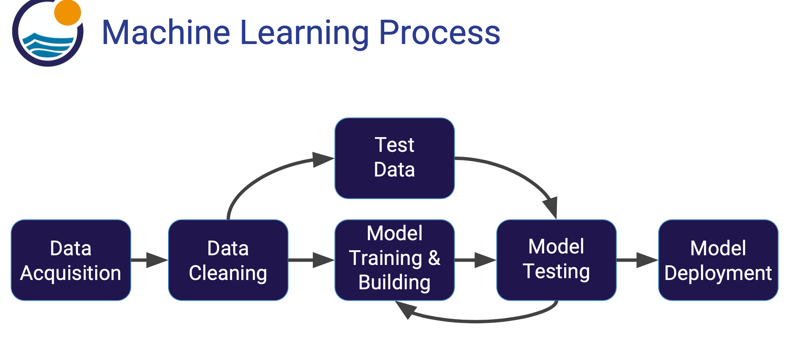

# Machine Learning with R
Serving as the notes and reference for machine learning with R

## Learning resources
[Data Science and Machine Learning bootcamp with R](https://www.udemy.com/course/data-science-and-machine-learning-bootcamp-with-r/learn/lecture/5412840#questions)
[ISLR](http://faculty.marshall.usc.edu/gareth-james/)

## Introduction
### What is Machine Learning
● Machine learning is a method of data analysis that automates analytical model building. 
● Using algorithms that iteratively learn from data, machine learning allows computers to find hidden insights without being explicitly programmed where to look.

### Supervised Learning
● Supervised learning algorithms are trained using labeled examples, such as an input where the desired output is known. 
● For example, a piece of equipment could have data points labeled either “F” (failed) or “R” (runs). 
● The learning algorithm receives a set of inputs along with the corresponding correct outputs, and the algorithm learns by comparing its actual output with correct outputs to find errors. 
● It then modifies the model accordingly. 
● Through methods like classification, regression, prediction and gradient boosting, supervised learning uses patterns to predict the values of the label on additional unlabeled data. 
● Supervised learning is commonly used in applications where historical data predicts likely future events. 
● For example, it can anticipate when credit card transactions are likely to be fraudulent or which insurance customer is likely to file a claim. 
● Or it can attempt to predict the price of a house based on different features for houses for which we have historical price data.
### Unsupervised Learning
● Unsupervised learning is used against data that has no historical labels. 
● The system is not told the "right answer." The algorithm must figure out what is being shown. 
● The goal is to explore the data and find some structure within. 
● Or it can find the main attributes that separate customer segments from each other. 
● Popular techniques include self-organizing maps, nearest- neighbor mapping, k-means clustering and singular value decomposition. 
● These algorithms are also used to segment text topics, recommend items and identify data outliers.
### Reinforcement Learning
● Reinforcement learning is often used for robotics, gaming and navigation. 
● With reinforcement learning, the algorithm discovers through trial and error which actions yield the greatest rewards. 
● This type of learning has three primary components: the agent (the learner or decision maker), the environment (everything the agent interacts with) and actions (what the agent can do). 
● The objective is for the agent to choose actions that maximize the expected reward over a given amount of time. 
● The agent will reach the goal much faster by following a good policy. 
● So the goal in reinforcement learning is to learn the best policy.
 
 
